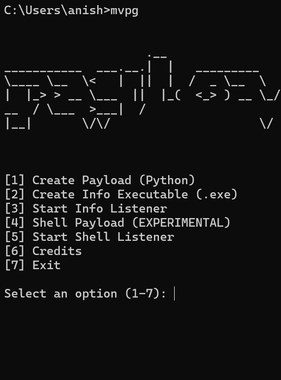
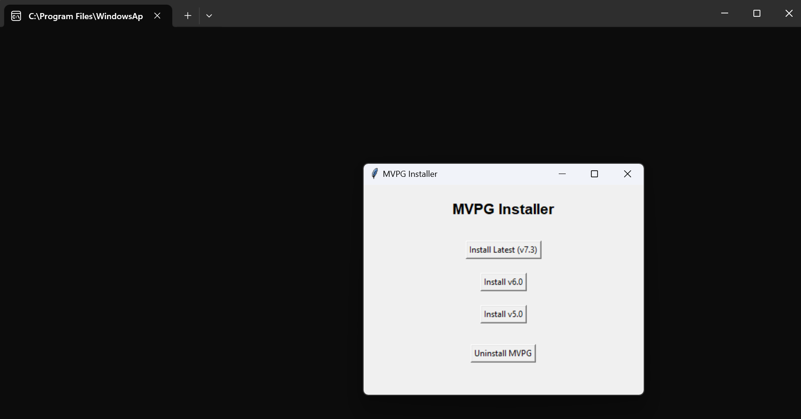

# MVPG (Multi Variant Payload Generator)

## Disclaimer
This tool is for educational purposes only. The author is not responsible for any misuse or damage caused by this program. Only use this on systems you have permission to test.

## Purpose
MVPG is a tool designed for educational and authorized penetration testing purposes. It helps security professionals and students understand how malware payloads work and how to defend against them.

## Installation
1. Make sure you have Python 3.x installed on your system
2. Clone this repository:
   ```
   git clone https://github.com/yourusername/mvpg.git 
   ```
3. Navigate to the MVPG directory
4. Run the installer:
   ```
   python install_mvpg.py
   ```
5. Follow the installation prompts
6. Restart your command prompt after installation
7. Run the tool by typing `mvpg` in your command prompt

## Usage
After installation, you can use MVPG from any command prompt: 

The tool provides various options for payload generation and testing. Always ensure you have proper authorization before testing on any system.

## Screenshots
### Main Interface


### Installation Process

## Features
- Multiple payload types
- Encrypted installation
- Easy-to-use interface
- Command-line functionality

## Requirements
- Windows Operating System
- Python 3.x
- Administrator privileges for installation

## Author
Souvik Ghosh

NOTE: I AM WORKING ON THE ASCII ART MAIN LOGO. IT'S MESSED UP... IT WILL GET FIXED IN THE NEXT VERSIONS OF THIS 

## License
This project is licensed under the MIT License - see the LICENSE file for details 